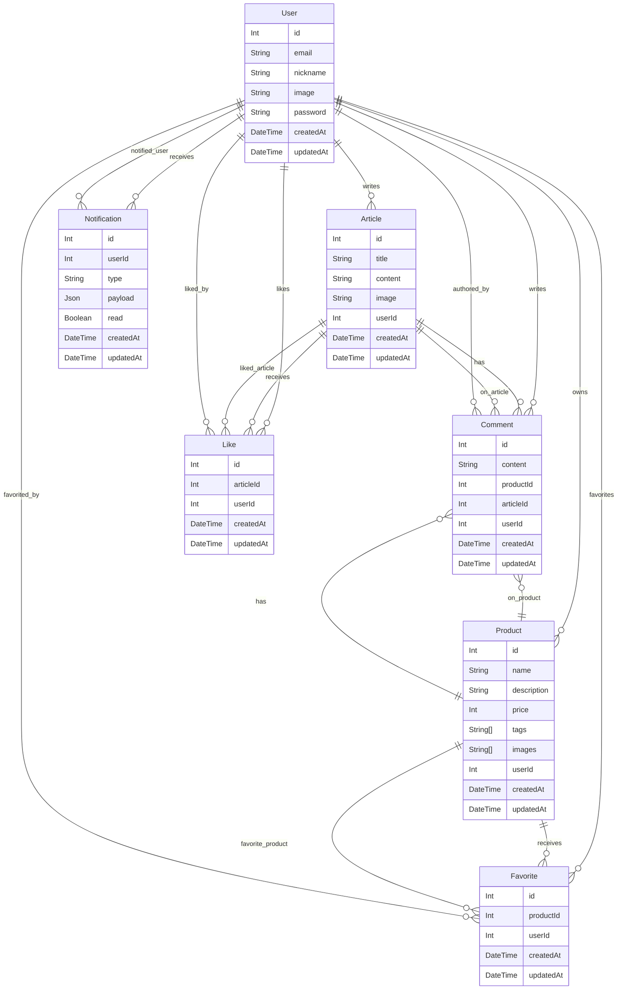

```mermaid
erDiagram
  User ||--o{ Article : writes
  User ||--o{ Product : owns
  User ||--o{ Comment : writes
  User ||--o{ Favorite : favorites
  User ||--o{ Like : likes
  User ||--o{ Notification : receives

  Article ||--o{ Comment : has
  Article ||--o{ Like : receives

  Product ||--o{ Comment : has
  Product ||--o{ Favorite : receives

  Comment }o--|| Product : on_product
  Comment }o--|| Article : on_article
  Comment }o--|| User : authored_by

  Favorite }o--|| Product : favorite_product
  Favorite }o--|| User : favorited_by

  Like }o--|| Article : liked_article
  Like }o--|| User : liked_by

  Notification }o--|| User : notified_user

  User {
    Int id
    String email
    String nickname
    String image
    String password
    DateTime createdAt
    DateTime updatedAt
  }

  Article {
    Int id
    String title
    String content
    String image
    Int userId
    DateTime createdAt
    DateTime updatedAt
  }

  Product {
    Int id
    String name
    String description
    Int price
    String[] tags
    String[] images
    Int userId
    DateTime createdAt
    DateTime updatedAt
  }

  Comment {
    Int id
    String content
    Int productId
    Int articleId
    Int userId
    DateTime createdAt
    DateTime updatedAt
  }

  Favorite {
    Int id
    Int productId
    Int userId
    DateTime createdAt
    DateTime updatedAt
  }

  Like {
    Int id
    Int articleId
    Int userId
    DateTime createdAt
    DateTime updatedAt
  }

  Notification {
    Int id
    Int userId
    String type
    Json payload
    Boolean read
    DateTime createdAt
    DateTime updatedAt
  }
```
