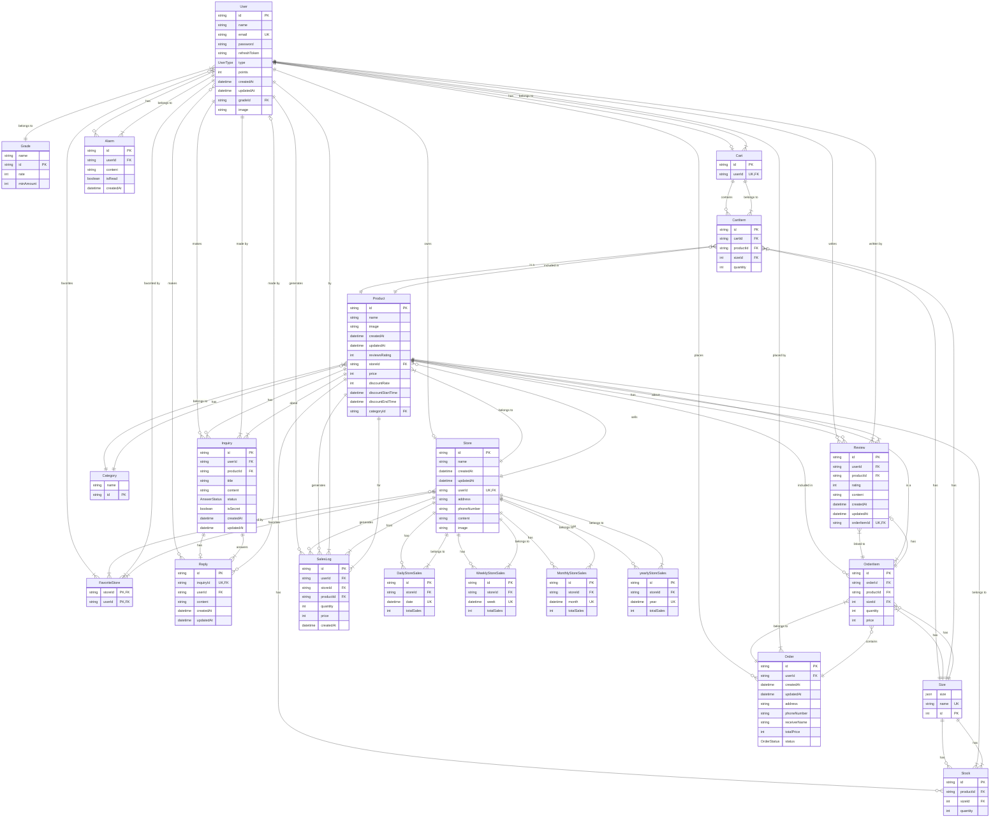

```mermaid
erDiagram
    User {
        string id PK
        string name
        string email UK
        string password
        string refreshToken
        UserType type
        int points
        datetime createdAt
        datetime updatedAt
        string gradeId FK
        string image
    }
    Grade {
        string name
        string id PK
        int rate
        int minAmount
    }
    Store {
        string id PK
        string name
        datetime createdAt
        datetime updatedAt
        string userId UK, FK
        string address
        string phoneNumber
        string content
        string image
    }
    FavoriteStore {
        string storeId PK, FK
        string userId PK, FK
    }
    Product {
        string id PK
        string name
        string image
        datetime createdAt
        datetime updatedAt
        int reviewsRating
        string storeId FK
        int price
        int discountRate
        datetime discountStartTime
        datetime discountEndTime
        string categoryId FK
    }
    Category {
        string name
        string id PK
    }
    Stock {
        string id PK
        string productId FK
        int sizeId FK
        int quantity
    }
    Size {
        json size
        string name UK
        int id PK
    }
    Inquiry {
        string id PK
        string userId FK
        string productId FK
        string title
        string content
        AnswerStatus status
        boolean isSecret
        datetime createdAt
        datetime updatedAt
    }
    Reply {
        string id PK
        string inquiryId UK, FK
        string userId FK
        string content
        datetime createdAt
        datetime updatedAt
    }
    Review {
        string id PK
        string userId FK
        string productId FK
        int rating
        string content
        datetime createdAt
        datetime updatedAt
        string orderItemId UK, FK
    }
    Cart {
        string id PK
        string userId UK, FK
    }
    CartItem {
        string id PK
        string cartId FK
        string productId FK
        int sizeId FK
        int quantity
    }
    Order {
        string id PK
        string userId FK
        datetime createdAt
        datetime updatedAt
        string address
        string phoneNumber
        string receiverName
        int totalPrice
        OrderStatus status
    }
    OrderItem {
        string id PK
        string orderId FK
        string productId FK
        int sizeId FK
        int quantity
        int price
    }
    SalesLog {
        string id PK
        string userId FK
        string storeId FK
        string productId FK
        int quantity
        int price
        datetime createdAt
    }
    DailyStoreSales {
        string id PK
        string storeId FK
        datetime date UK
        int totalSales
    }
    WeeklyStoreSales {
        string id PK
        string storeId FK
        datetime week UK
        int totalSales
    }
    MonthlyStoreSales {
        string id PK
        string storeId FK
        datetime month UK
        int totalSales
    }
    yearlyStoreSales {
        string id PK
        string storeId FK
        datetime year UK
        int totalSales
    }
    Alarm {
        string id PK
        string userId FK
        string content
        boolean isRead
        datetime createdAt
    }


    User }|--|| Grade : "belongs to"
    User ||--o{ Alarm : "has"
    User ||--o| Cart : "has"
    User }o--|{ FavoriteStore : "favorites"
    User ||--o{ Inquiry : "makes"
    User ||--o{ Order : "places"
    User }o--o{ Reply : "makes"
    User ||--o{ Review : "writes"
    User ||--o{ SalesLog : "generates"
    User ||--o| Store : "owns"

    Store ||--o{ Product : "sells"
    Store ||--o{ SalesLog : "generates"
    Store }o--|{ FavoriteStore : "favorited by"
    Store ||--o{ DailyStoreSales : "has"
    Store ||--o{ WeeklyStoreSales : "has"
    Store ||--o{ MonthlyStoreSales : "has"
    Store ||--o{ yearlyStoreSales : "has"

    FavoriteStore }|--|| User : "favorited by"
    FavoriteStore }|--|| Store : "favorites"

    Product }|--|| Store : "belongs to"
    Product }|--|| Category : "belongs to"
    Product ||--o{ Review : "has"
    Product ||--o{ Inquiry : "has"
    Product ||--o{ Stock : "has"
    Product ||--o{ CartItem : "included in"
    Product ||--o{ OrderItem : "included in"
    Product ||--o{ SalesLog : "generates"

    Category ||--o{ Product : "has"

    Stock }|--|| Product : "belongs to"
    Stock }|--|| Size : "has"

    Size ||--o{ Stock : "has"
    Size ||--o{ CartItem : "has"
    Size ||--o{ OrderItem : "has"

    Inquiry }|--|| User : "made by"
    Inquiry }|--|| Product : "about"
    Inquiry ||--o| Reply : "has"

    Reply }|--|| Inquiry : "answers"
    Reply }o--o| User : "made by"

    Review }|--|| User : "written by"
    Review }|--|| Product : "about"
    Review }|--|| OrderItem : "linked to"

    Cart }|--|| User : "belongs to"
    Cart ||--o{ CartItem : "contains"

    CartItem }|--|| Cart : "belongs to"
    CartItem }|--|| Product : "is a"
    CartItem }|--|| Size : "has"

    Order }|--|| User : "placed by"
    Order ||--o{ OrderItem : "contains"

    OrderItem }|--|| Order : "belongs to"
    OrderItem }|--|| Product : "is a"
    OrderItem }|--|| Size : "has"
    OrderItem ||--o| Review : "has"

    SalesLog }|--|| User : "by"
    SalesLog }|--|| Store : "from"
    SalesLog }|--|| Product : "for"

    DailyStoreSales }|--|| Store : "belongs to"
    WeeklyStoreSales }|--|| Store : "belongs to"
    MonthlyStoreSales }|--|| Store : "belongs to"
    yearlyStoreSales }|--|| Store : "belongs to"

    Alarm }|--|| User : "belongs to"
```
