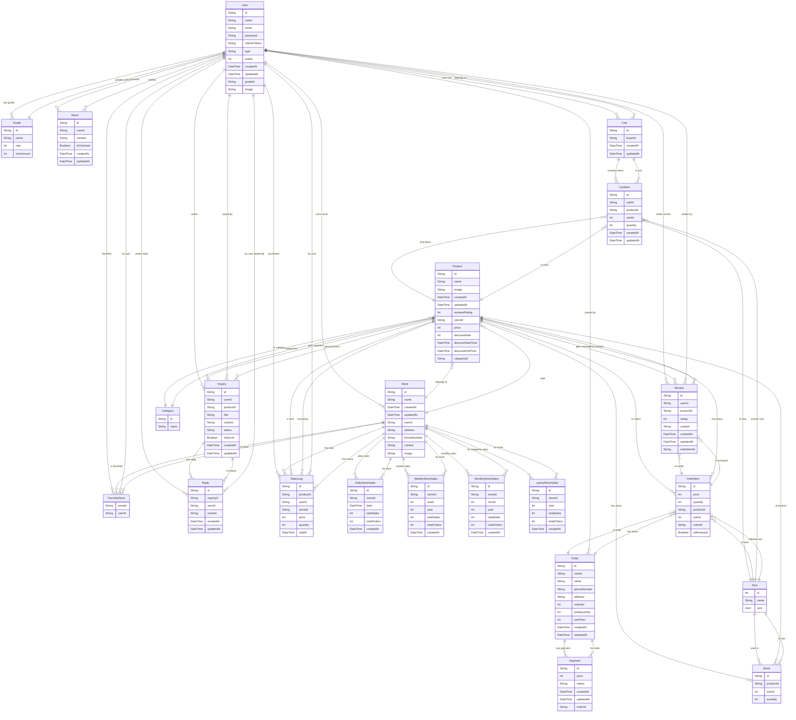

```mermaid
erDiagram
  User ||--o{ Grade : "has grade"
  User ||--o{ Alarm : "receives"
  User ||--o{ Cart : "has cart"
  User ||--o{ FavoriteStore : "favorites"
  User ||--o{ Inquiry : "writes"
  User ||--o{ Reply : "writes reply"
  User ||--o{ Review : "writes review"
  User ||--o{ SalesLog : "purchases"
  User ||--o{ Store : "owns store"

  Grade ||--o{ User : "grades users"

  Store ||--o{ FavoriteStore : "is favorited"
  Store ||--o{ Product : "sells"
  Store ||--o{ SalesLog : "has logs"
  Store ||--o{ DailyStoreSales : "daily sales"
  Store ||--o{ WeeklyStoreSales : "weekly sales"
  Store ||--o{ MonthlyStoreSales : "monthly sales"
  Store ||--o{ yearlyStoreSales : "yearly sales"

  FavoriteStore }o--|| User : "by user"
  FavoriteStore }o--|| Store : "of store"

  Product ||--o{ Review : "gets reviews"
  Product ||--o{ Inquiry : "gets inquiries"
  Product ||--o{ CartItem : "in carts"
  Product ||--o{ OrderItem : "in orders"
  Product ||--o{ Stock : "has stock"
  Product }o--|| Store : "belongs to"
  Product }o--|| Category : "in category"
  Product ||--o{ SalesLog : "is sold"

  Category ||--o{ Product : "categorizes"

  Stock }o--|| Product : "of product"
  Stock }o--|| Size : "of size"

  Size ||--o{ CartItem : "chosen size"
  Size ||--o{ OrderItem : "ordered size"
  Size ||--o{ Stock : "used in"

  Inquiry }o--|| User : "asked by"
  Inquiry }o--|| Product : "about product"
  Inquiry ||--o{ Reply : "has reply"

  Reply }o--|| Inquiry : "to inquiry"
  Reply }o--|| User : "by user (optional)"

  Review }o--|| User : "written by"
  Review }o--|| Product : "about product"
  Review }o--|| OrderItem : "on order"

  Cart }o--|| User : "belongs to"
  Cart ||--o{ CartItem : "contains items"

  CartItem }o--|| Cart : "in cart"
  CartItem }o--|| Product : "of product"
  CartItem }o--|| Size : "of size"

  Order }o--|| User : "placed by"
  Order ||--o{ OrderItem : "has items"
  Order ||--o{ Payment : "has payment"

  OrderItem }o--|| Order : "in order"
  OrderItem }o--|| Product : "of product"
  OrderItem }o--|| Size : "of size"
  OrderItem ||--o{ Review : "is reviewed"

  Payment }o--|| Order : "for order"

  Alarm }o--|| User : "notifies"

  SalesLog }o--|| Product : "of product"
  SalesLog }o--|| User : "by user"
  SalesLog }o--|| Store : "from store"

  DailyStoreSales }o--|| Store : "for store"
  WeeklyStoreSales }o--|| Store : "for store"
  MonthlyStoreSales }o--|| Store : "for store"
  yearlyStoreSales }o--|| Store : "for store"

  User {
    String id
    String name
    String email
    String password
    String refreshToken
    String type
    Int points
    DateTime createdAt
    DateTime updatedAt
    String gradeId
    String image
  }

  Grade {
    String id
    String name
    Int rate
    Int minAmount
  }

  Store {
    String id
    String name
    DateTime createdAt
    DateTime updatedAt
    String userId
    String address
    String phoneNumber
    String content
    String image
  }

  FavoriteStore {
    String storeId
    String userId
  }

  Product {
    String id
    String name
    String image
    DateTime createdAt
    DateTime updatedAt
    Int reviewsRating
    String storeId
    Int price
    Int discountRate
    DateTime discountStartTime
    DateTime discountEndTime
    String categoryId
  }

  Category {
    String id
    String name
  }

  Stock {
    String id
    String productId
    Int sizeId
    Int quantity
  }

  Size {
    Int id
    String name
    Json size
  }

  Inquiry {
    String id
    String userId
    String productId
    String title
    String content
    String status
    Boolean isSecret
    DateTime createdAt
    DateTime updatedAt
  }

  Reply {
    String id
    String inquiryId
    String userId
    String content
    DateTime createdAt
    DateTime updatedAt
  }

  Review {
    String id
    String userId
    String productId
    Int rating
    String content
    DateTime createdAt
    DateTime updatedAt
    String orderItemId
  }

  Cart {
    String id
    String buyerId
    DateTime createdAt
    DateTime updatedAt
  }

  CartItem {
    String id
    String cartId
    String productId
    Int sizeId
    Int quantity
    DateTime createdAt
    DateTime updatedAt
  }

  Order {
    String id
    String userId
    String name
    String phoneNumber
    String address
    Int subtotal
    Int totalQuantity
    Int usePoint
    DateTime createdAt
    DateTime updatedAt
  }

  OrderItem {
    String id
    Int price
    Int quantity
    String productId
    Int sizeId
    String orderId
    Boolean isReviewed
  }

  Payment {
    String id
    Int price
    String status
    DateTime createdAt
    DateTime updatedAt
    String orderId
  }

  Alarm {
    String id
    String userId
    String content
    Boolean isChecked
    DateTime createdAt
    DateTime updatedAt
  }

  SalesLog {
    String id
    String productId
    String userId
    String storeId
    Int price
    Int quantity
    DateTime soldAt
  }

  DailyStoreSales {
    String id
    String storeId
    DateTime date
    Int totalSales
    Int totalOrders
    DateTime createdAt
  }

  WeeklyStoreSales {
    String id
    String storeId
    Int week
    Int year
    Int totalSales
    Int totalOrders
    DateTime createdAt
  }

  MonthlyStoreSales {
    String id
    String storeId
    Int month
    Int year
    Int totalSales
    Int totalOrders
    DateTime createdAt
  }

  yearlyStoreSales {
    String id
    String storeId
    Int year
    Int totalSales
    Int totalOrders
    DateTime createdAt
  }
```
