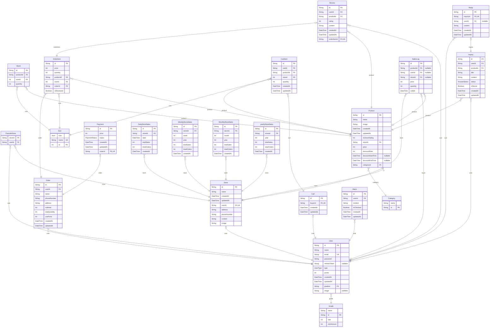

```mermaid
erDiagram
"User" {
  String id PK
  String name
  String email UK
  String password
  String refreshToken "nullable"
  UserType type
  Int points
  DateTime createdAt
  DateTime updatedAt
  String gradeId FK
  String image "nullable"
}
"Grade" {
  String name
  String id PK
  Int rate
  Int minAmount
}
"Store" {
  String id PK
  String name
  DateTime createdAt
  DateTime updatedAt
  String userId FK,UK
  String address
  String phoneNumber
  String content
  String image
}
"FavoriteStore" {
  String storeId FK
  String userId FK
}
"Product" {
  String id PK
  String name
  String image
  DateTime createdAt
  DateTime updatedAt
  Int reviewsRating
  String storeId FK
  Int price
  Int discountRate
  DateTime discountStartTime "nullable"
  DateTime discountEndTime "nullable"
  String categoryId FK
}
"Category" {
  String name
  String id PK
}
"Stock" {
  String id PK
  String productId FK
  Int sizeId FK
  Int quantity
}
"Size" {
  Json size
  String name UK
  Int id PK
}
"Inquiry" {
  String id PK
  String userId FK
  String productId FK
  String title
  String content
  AnswerStatus status
  Boolean isSecret
  DateTime createdAt
  DateTime updatedAt
}
"Reply" {
  String id PK
  String inquiryId FK,UK
  String userId FK "nullable"
  String content
  DateTime createdAt
  DateTime updatedAt
}
"Review" {
  String id PK
  String userId FK
  String productId FK
  Int rating
  String content
  DateTime createdAt
  DateTime updatedAt
  String orderItemId FK,UK
}
"Cart" {
  String id PK
  String buyerId FK,UK
  DateTime createdAt
  DateTime updatedAt
}
"CartItem" {
  String id PK
  String cartId FK
  String productId FK
  Int sizeId FK
  Int quantity
  DateTime createdAt
  DateTime updatedAt
}
"Order" {
  String id PK
  String userId FK
  String name
  String phoneNumber
  String address
  Int subtotal
  Int totalQuantity
  Int usePoint
  DateTime createdAt
  DateTime updatedAt
}
"OrderItem" {
  String id PK
  Int price
  Int quantity
  String productId FK
  Int sizeId FK
  String orderId FK
  Boolean isReviewed
}
"Payment" {
  String id PK
  Int price
  PaymentStatus status
  DateTime createdAt
  DateTime updatedAt
  String orderId FK,UK
}
"Alarm" {
  String id PK
  String userId FK
  String content
  Boolean isChecked
  DateTime createdAt
  DateTime updatedAt
}
"SalesLog" {
  String id PK
  String productId FK "nullable"
  String userId FK "nullable"
  String storeId FK "nullable"
  Int price
  Int quantity
  DateTime soldAt
}
"DailyStoreSales" {
  String id PK
  String storeId FK
  DateTime date
  Int totalSales
  Int totalOrders
  DateTime createdAt
}
"WeeklyStoreSales" {
  String id PK
  String storeId FK
  Int week
  Int year
  Int totalSales
  Int totalOrders
  DateTime createdAt
}
"MonthlyStoreSales" {
  String id PK
  String storeId FK
  Int month
  Int year
  Int totalSales
  Int totalOrders
  DateTime createdAt
}
"yearlyStoreSales" {
  String id PK
  String storeId FK
  Int year
  Int totalSales
  Int totalOrders
  DateTime createdAt
}
"User" }o--|| "Grade" : grade
"Store" |o--|| "User" : user
"FavoriteStore" }o--|| "Store" : store
"FavoriteStore" }o--|| "User" : user
"Product" }o--|| "Store" : store
"Product" }o--|| "Category" : category
"Stock" }o--|| "Product" : product
"Stock" }o--|| "Size" : size
"Inquiry" }o--|| "User" : user
"Inquiry" }o--|| "Product" : product
"Reply" |o--|| "Inquiry" : inquiry
"Reply" }o--o| "User" : user
"Review" }o--|| "User" : user
"Review" }o--|| "Product" : product
"Review" |o--|| "OrderItem" : orderItem
"Cart" |o--|| "User" : user
"CartItem" }o--|| "Cart" : cart
"CartItem" }o--|| "Product" : product
"CartItem" }o--|| "Size" : size
"Order" }o--|| "User" : user
"OrderItem" }o--|| "Product" : product
"OrderItem" }o--|| "Size" : size
"OrderItem" }o--|| "Order" : order
"Payment" |o--|| "Order" : order
"Alarm" }o--|| "User" : user
"SalesLog" }o--o| "Product" : product
"SalesLog" }o--o| "User" : buyer
"SalesLog" }o--o| "Store" : store
"DailyStoreSales" }o--|| "Store" : store
"WeeklyStoreSales" }o--|| "Store" : store
"MonthlyStoreSales" }o--|| "Store" : store
"yearlyStoreSales" }o--|| "Store" : store
```
