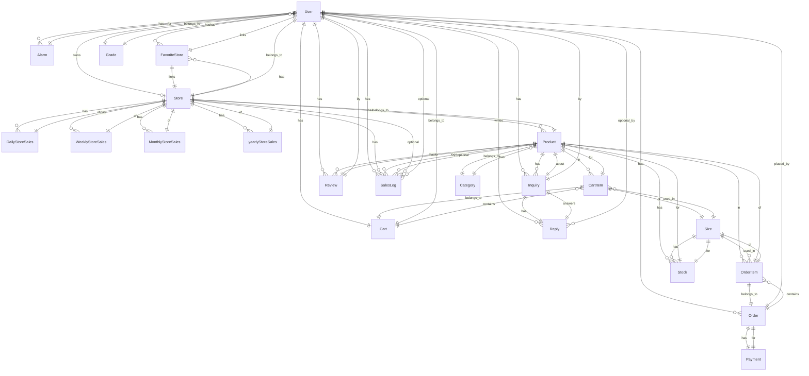

```mermaid
erDiagram
  User ||--o{ Alarm : has
  User ||--o{ FavoriteStore : has
  User ||--o{ Inquiry : has
  User ||--o{ Order : has
  User ||--o{ Review : has
  User ||--o{ SalesLog : has
  User ||--|| Cart : has
  User ||--o| Store : owns
  User }o--|| Grade : belongs_to
  User ||--o{ Reply : writes

  Grade ||--o{ User : has

  Store ||--|| User : belongs_to
  Store ||--o{ DailyStoreSales : has
  Store ||--o{ WeeklyStoreSales : has
  Store ||--o{ MonthlyStoreSales : has
  Store ||--o{ yearlyStoreSales : has
  Store ||--o{ FavoriteStore : has
  Store ||--o{ Product : has
  Store ||--o{ SalesLog : has

  FavoriteStore ||--|| Store : links
  FavoriteStore ||--|| User : links

  Product ||--|| Store : belongs_to
  Product ||--o{ Review : has
  Product ||--o{ Inquiry : has
  Product ||--o{ CartItem : in
  Product ||--o{ OrderItem : in
  Product ||--o{ Stock : has
  Product ||--o{ SalesLog : logs
  Product }o--|| Category : belongs_to

  Category ||--o{ Product : has

  Stock ||--|| Product : for
  Stock ||--|| Size : for

  Size ||--o{ CartItem : used_in
  Size ||--o{ OrderItem : used_in
  Size ||--o{ Stock : has

  Inquiry ||--|| Product : about
  Inquiry ||--|| User : by
  Inquiry ||--|| Reply : has

  Reply ||--|| Inquiry : answers
  Reply }o--|| User : optional_by

  Review ||--|| Product : for
  Review ||--|| User : by

  Cart ||--|| User : belongs_to
  Cart ||--o{ CartItem : contains

  CartItem ||--|| Cart : belongs_to
  CartItem ||--|| Product : for
  CartItem ||--|| Size : of

  Order ||--|| User : placed_by
  Order ||--o{ OrderItem : contains
  Order ||--|| Payment : has

  OrderItem ||--|| Order : belongs_to
  OrderItem ||--|| Product : of
  OrderItem ||--|| Size : of

  Payment ||--|| Order : for

  Alarm ||--|| User : for

  SalesLog }o--|| Product : optional
  SalesLog }o--|| Store : optional
  SalesLog }o--|| User : optional

  DailyStoreSales ||--|| Store : of
  WeeklyStoreSales ||--|| Store : of
  MonthlyStoreSales ||--|| Store : of
  yearlyStoreSales ||--|| Store : of
```
